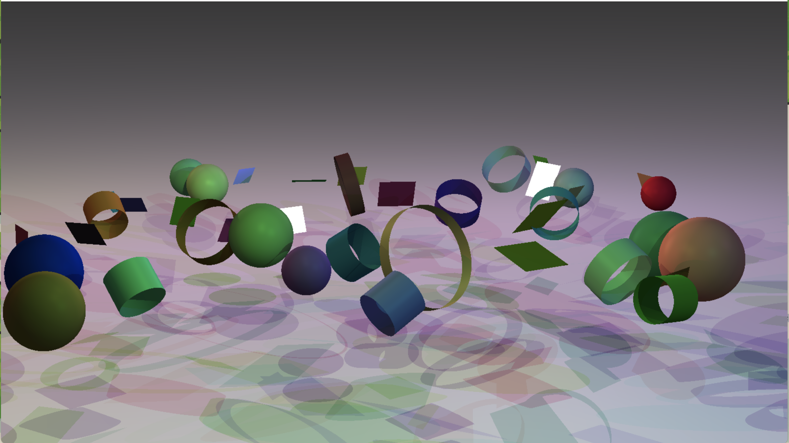
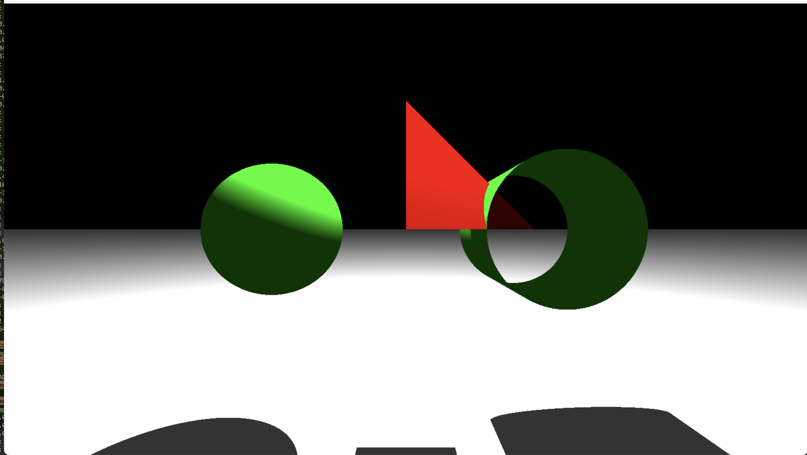

# Mini Raytracing With C

# Example




# How to Start

```shell
git clone https://github.com/rkskekzzz/miniRaytracing.git
cd miniRaytracing
make
./miniRT maps/map1.rt
```

- maps 폴더의 map.rt 파일을 사용하거나 수정하여 실행할 수 있습니다.

- make가 안되는 경우 srcs/mlx 디렉토리에서 `make`를 한번 실행해주세요

# Description

## 구현한 내용

- 구, 원기둥, 평면, 삼각형, 사각형 구현
- 조명 및 그림자 구현
- 모든 오브젝트는 map 파일을 활용해서 설정 가능
- 매질, 굴절, 반사 구현

## 어려웠던 내용

**빛의 굴절 및 반사 처리와 랜더링 성능 향상**

Raytracing을 직접 구현하다 보니 수학적인 지식이 많이 필요했습니다. 충돌과 같은 경우 판별식을 활용하면 어렵지 않게 구현할 수 있었지만, 굴절률과 반사율을 계산하고 구현하는 것이 까다로웠습니다. 특히 반사의 경우 반사가 한 번 이루어질 때마다 흡수율이 존재해야 했고 굴절은 매질마다 굴절, 반사가 동시에 일어나야 했습니다. 한 번에 구현하는 것이 어려웠기 때문에, 100% 반사부터 구현하고, 흡수율 구현, 굴절 구현 등 작은 업무 단위로 쪼개어서 개발을 진행하였습니다.
